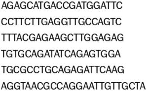
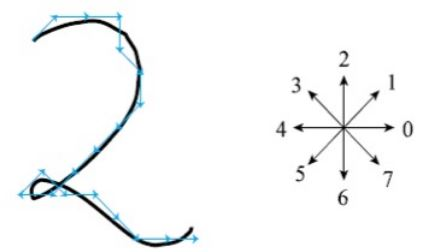
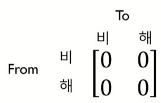
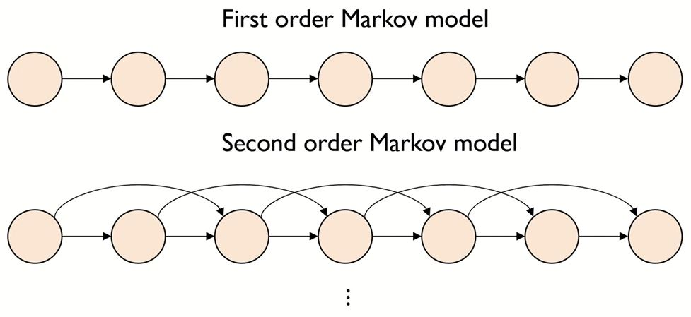
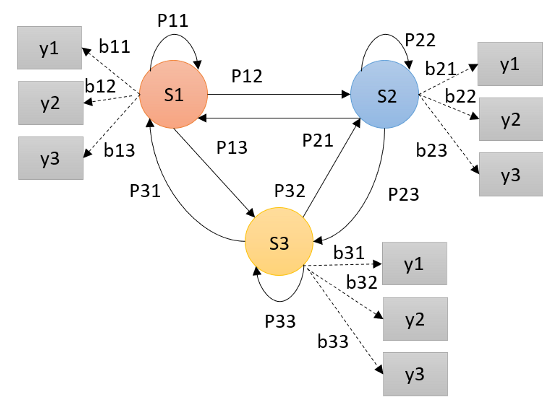
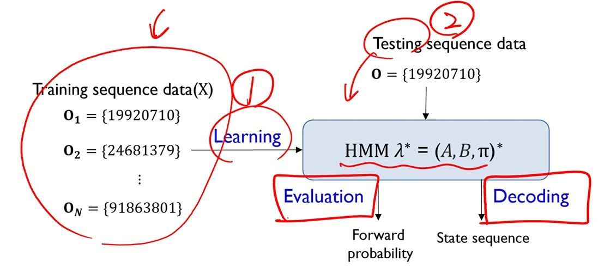
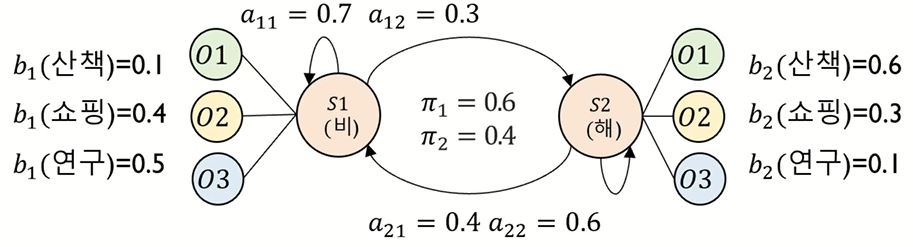

# 02-EX. Hidden Markov Models - Part 1. 개념, Evaluation

>본 내용은 고려대학교 김성범 교수님의 영상 강의를 기반으로 정리된 내용 입니다.
>
>[[핵심 머신러닝] Hidden Markov Models - Part 1](https://youtu.be/HB9Nb0odPRs)

## 개념

### 순차 데이터

- 순서가 있는 데이터를 지칭 (Sequential Data)
- 보통 시간에 따라서 얻어지는 데이터가 있음
  - 예)
    $$
    X = (x_1, x_2, \dots, x_i, x_{i+1}, \dots, x_d)\\
    X = (x_z, \dots, x_t, x_{t+1}, \dots x_T)
    $$

### 순차 데이터 예시

- 시간의 특성이 있음

- Sequence data (Discrete)

  - 예) DNA Sequence

     순차적으로 시간에 따라 다름

  - 예) Equipment sequential data in manufacturing processes

    | 제품 | 공정1 | 공정2 | 공정3 | 공정4 | 공정5 | 공정6 | 공정7 | 공정8 | 공정9 | 공정10 | Class |
    | ---- | ----- | ----- | ----- | ----- | ----- | ----- | ----- | ----- | ----- | ------ | ----- |
    | 1    | 설비1 | 설비2 | 설비1 | 설비1 | 설비2 | 설비1 | 설비4 | 설비2 | 설비2 | 설비1  | 정상  |
    | 2    | 설비2 | 설비4 | 설비2 | 설비2 | 설비4 | 설비2 | 설비4 | 설비2 | 설비4 | 설비2  | 정상  |
    | 3    | 설비1 | 설비3 | 설비1 | 설비1 | 설비3 | 설비1 | 설비3 | 설비1 | 설비3 | 설비1  | 정상  |
    | ...  | ...   | ...   | ...   | ...   | ...   | ...   | ...   | ...   | ...   | ...    | ...   |
    | 2998 | 설비3 | 설비3 | 설비3 | 설비3 | 설비3 | 설비3 | 설비3 | 설비3 | 설비3 | 설비3  | 불량  |
    | 2999 | 설비4 | 설비1 | 설비2 | 설비4 | 설비6 | 설비5 | 설비5 | 설비1 | 설비2 | 설비3  | 불량  |
    | 3000 | 설비5 | 설비5 | 설비1 | 설비3 | 설비1 | 설비5 | 설비1 | 설비3 | 설비1 | 설비1  | 불량  |

    - 제품 1: 공정1(설비1) → 공정2(설비2) → 공정3(설비1) → ...

  - 예) 숫자 이미지 데이터

     좌측: 손글씨 숫자, 우측: 방향(백터)의 X값

    - X = 100676555541707700

#### Hidden Markov Model(HMM) 이란?

- 순차데이터를 확률적(Stochastic)으로 모델링 하는 생성 모델(Generative Model)
- Hidden(숨겨져 있는 or 관측이 되지 않는) Markov Model(확률 모델)

### Markov Model

#### Markov Model?

- State로 이루어진 Sequence를 상태 전이 확률 행렬로 표현하는 것

- 상태 전이 확률 행렬 예시

  - Sequence

    - 월 → 화 → 수 → 목 → 금 → 토 → 일

      비 → 해 → 해 → 해 → 비 → 비 → 해

  - State: {비, 해}

  - State transition probability matrix(상태 전이 확률 행렬): 

    
    $$
    \begin{bmatrix}
    1 &  2 \\
    1 &  2
    \end{bmatrix} \Big/ 3\mbox{(상태가 변경된 전체 횟수)} = 
    \begin{bmatrix}
    1/3 &  2/3 \\
    1/3 &  2/3
    \end{bmatrix}
    $$

- Markov 가정: **시간 t**에서 관측은 **가장 최근 r개의 관측에만 의존**한다는 가정

- 한 상태에서 다른 상태로의 전이는 <u>이전 상태의 긴 이력</u>을 **필요치 않다는 가정**

  - 대부분의 경우 아주 먼 과거는 현제의 결과에 큰 영향을 주지 않는다는 가정

  $$
  \mbox{If }\quad r=1\mbox{, }\quad p(s_t|s_{t-1} s_{t-2} \cdots s_1) = p(s_t|s_{t-1})\\
  \mbox{If }\quad r=2\mbox{, }\quad p(s_t|s_{t-1} s_{t-2} \cdots s_1) = p(s_t|s_{t-1}, s_{t-2})\\
  \cdots
  $$

  

#### Parameters of the Markov model

- 상태 전이 확률 행렬

  - 바로 이전 상태만 고려하는 First order Markov model

  

  |                 | Bull market | Bear market | Stagnant market |
  | --------------: | :---------: | :---------: | :-------------: |
  |     Bull market |     0.9     |    0.075    |      0.25       |
  |     Bear market |    0.15     |     0.8     |      0.05       |
  | Stagnant market |    0.25     |    0.25     |       0.5       |

### Hidden Markov Models 개념

#### Hidden Markov model?

- Type of states

  - State sequence 1: (s1 , s2, s3, ... , sT-1, sT )

  - State sequence 2: (o1 , o2, o3, ... , oT-1, oT )

    - 월 → 화 → 수 → 목 → 금 → 토 → 일

      비 → 해 → 해 → 해 → 비 → 비 → 해 (Sequence 1)

      산책 → 쇼핑 → 산책 → 쇼핑 → 연구 → 연구 → 연구 (Sequence 2)

- 같은 시간에 발생한 두 종류의 state sequence 각각의 **특성**과 그들의 **관계**를 이용해 **모델링**

- Why **Hidden** markov?

  - **Hidden** state: Sequence 1
    - 관측 불가능
  - **Observable** state: Sequence 2
    - 관측 가능
  - 예를들어, 그 사람이 **어떤 행동**을 하는지 **볼 수는 있지만**, 그 날씨는 모른다고 가정하는 것
  - 상대방의 행동만 보고 확률을 계산하는 것

- Hidden sequence가 **Markov assumption**을 따름

  - 시간에 따른 **순차 데이터**와 같은 형태

- Observable sequence는 **Hidden sequence에 종속**

  - 예를들어, 날씨가 어떠냐에 따른 행동이 정해 지는 상황
    - 해가 떴다는 가정 하에 쇼핑을 진행

- Hidden Markov Model Graph

  

  - S1, S2, S3: 은닉 상태 (Hidden state)
    - P: Hidden state의 transition probability
  - y1, y2, y3: 관측 가능 상태 (Observable state)

  

### Hidden Markov Model 예제

#### Hidden Markov Model (HMM) 예제 (Observable vs Hidden)

  - 특정인의 행동(쇼핑, 연구, 산책)에 따라 날씨 추측
  - 빈대떡 소비량에 따른 날씨 추측 
  - 중국음식 배달량에 따른 날씨 추측
  - 공 색깔정보에 따라 그 공이 담겨있는 상자의 종류 추측
  - DNA 염기서열(ACGT...)에서 어느 부분이 유전자(Gene)인지 추측
  - 주어진 단어의 품사 추측
  - ...

  

### Hidden Markov Models - Parameters

  - HMM의 Parameter

    - A(aij): 상태전이확률 행렬(State transition probability matrix)
    - B(bjk): 방출확률 행렬(Emisstion probability matrix)
    - π(*π*i): 초기 확률 행렬

  - 
    $$
    \mbox{All Columns = {S1, S2, S3}}\\
    A=\begin{bmatrix}
    P_{11} & P_{12} & P_{13}\\
    P_{21} & P_{22} & P_{23}\\
    P_{31} & P_{32} & P_{33}\\
    \end{bmatrix} \quad\mbox{for Rows={S1, S2, S3}},\quad
    B=\begin{bmatrix}
    b_{11} & b_{12} & b_{13}\\
    b_{21} & b_{22} & b_{23}\\
    b_{31} & b_{32} & b_{33}\\
    \end{bmatrix}\quad\mbox{for Rows={y1, y2, y3}}
    $$

    - B의 경우 S1에서 각 observable state의 확률이 각 column의 row값

    - Initial parameter
      $$
      \pi=\begin{bmatrix}
      \pi_{1}\\
      \pi_{2}\\
      \pi_{3}\\
      \end{bmatrix} = S_0\quad \mbox{Initial state}\\
      \mbox{All Columns = {S1, S2, S3}}\\
      A=\begin{bmatrix}
      P_{11} & P_{12} & P_{13}\\
      P_{21} & P_{22} & P_{23}\\
      P_{31} & P_{32} & P_{33}\\
      \end{bmatrix} \quad\mbox{for Rows={S1, S2, S3}},\quad
      B=\begin{bmatrix}
      b_{11} & b_{12} & b_{13}\\
      b_{21} & b_{22} & b_{23}\\
      b_{31} & b_{32} & b_{33}\\
      \end{bmatrix}\quad\mbox{for Rows={y1, y2, y3}}
      $$

  

#### HMM Parameter 정리

- A(aij): State transition probability matrix(상태전이확률 행렬)
- B(bjk): Emisstion probability matrix(방출확률 행렬)
- π(*π*i): Initial state probability matrix
- 

#### Parameters of HMM λ={A, B, π}

- State transition probability A = |aij|

  - A: HMM이 작동하는 도중 다음 상태를 결정

  - t시점에서 i에 있다가 t+1에서는 j라는 상태로 가는 의미
    $$
    a_{ij}=p(q_{t+1}=s_j|q_t=s_i), \quad 1\leq i, j\leq n\\
    \sum^n_{j=1}a_{ij}=1
    $$
    

- Emission probability B = |bj(vk)|

  - B: HMM이 어느 상태에 도달하였을 때, 그 상태에서 **관측될 확률 결정**

  - bj(vk): **은닉상태(Hidden state) bj**에서 관측치 **vk**가 도출될 확률
    $$
    b_j(v_k)=P(o_t=v_k|q_t=s_j), \quad 1\leq j\leq n,\quad 1\leq k\leq m\\
    \sum^n_{j=1}b_j(v_k)=1
    $$
    

- Initial state probability π=|*π*i|

  - HMM을 가동 시킬 때 어느 상태에서 시작할지 결정

  - State에 따라 갯수가 정해짐
    $$
    \sum^n_{i=1}\pi_i=1
    $$

## Evaluation

### Main Problems of HMM

- Hidden Markov model λ = (A, B, π)

#### Three problems of HMM

- Evaluation problem
  - HMM모델 λ = (A, B, π)이 주어지고 관측되는 상태 O가 주어졌을 때
  - 그 **Observable state의 확률**을 구하는 문제
- **Decoding problem(Point of main)**
  - HMM모델 λ = (A, B, π)이 주어지고 관측되는 상태 O가 주어졌을 때
  - 그것에 해당하는 **Hidden state sequence를** 알아내는 문제
- Learning problem
  - 1번과 2번을 하기 위한 선행 문제
  - Observable state sequence가 주어졌을 때(Input X data), **HMM 모델 λ의 parameter를 추측**하는 문제

### Hidden Markov Models - Evaluation

- 문제 예시

  - 다음과 같은 HMM parameter와 Observable state가 주어졌을 때

  - 오늘 산책, 내일 산책, 모레 연구, 글피 쇼핑을 할 확률은?

    

  - Issue 발견

    - Object
      $$
      O = (o_1=\mbox{산책},o_2=\mbox{산책},o_3=\mbox{연구},o_4=\mbox{쇼핑})\\
      \mbox{Probability (O)=}(o_1=\mbox{산책},o_2=\mbox{산책},o_3=\mbox{연구},o_4=\mbox{쇼핑})=?
      $$

    - Parameters
      $$
      \pi=\begin{bmatrix}
      0.6\\
      0.4\\
      \end{bmatrix} = S_0\quad \mbox{Initial state}\\
      \mbox{All Columns = {S1, S2, S3}}\\
      A=\begin{bmatrix}
      0.7 & 0.3\\
      0.4 & 0.6
      \end{bmatrix} \quad\mbox{for Rows={S1, S2}},\quad 
      B=\begin{bmatrix}
      0.1 & 0.6\\
      0.4 & 0.3\\
      0.5 & 0.1
      \end{bmatrix}\quad\mbox{for Rows={O1, O2, O3}}
      $$
      

    - Issue: Hidden state의 종류
      $$
      S1, S2\quad \mbox{ total 2}\\
      \mbox{모든 상태의 종류 = }\quad \mbox{상태 갯수}^\mbox{원하는 관측의 수}\\
      \mbox{문제에서 원하는 모든 상태의 종류 = }2^4 = 16\mbox{가지}\\
      \{\mbox{비, 비, 비, 비}\}\\
      \{\mbox{비, 비, 비, 해}\}\\
      \{\mbox{비, 비, 해, 비}\}\\
      \dots
      $$

  - Solutaion: Forward algorithm (Evaluation problem)

    - 

    $$
    
    $$

    

