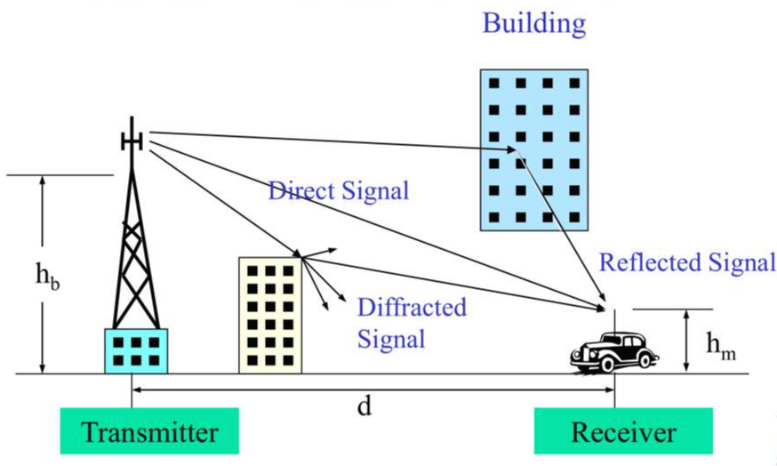

# 03-01. Mobile Radio Propagation

---

## 3.1 소개

---

전파 전파(이하 **Radio propagation**)

- 번역이 조금 어색함

무선 이동 통신 채널은 하나의 무선 단말과 다른 하나의 무선 단말 사이에 시간적으로 변화하는 통신 경로로 모형화 한 것이다.

- 첫 번째 단말: 기지국에 있는 고정안테나
- 두 번째 단말: 이동국이나 이동 중인 가입자

위의 상황은 빠른 페이딩(**Fast fading**)을 유발하는 **Multi path** Radio propagation 유발한다.

이동 무선 전파

- 전 방향성 안테나
- 반송파 주파수의 선정
- Fast fading 환경에서의 전송 방식의 선택
- 등등 새로운 도전(?)이 필요

Multi path channel 환경에서의 radio propagation

- 안테나의 높이
- 빌딩들의 배치
- 나무, 도로, 주변 지형 등에 좌우 됨

해당 Chapter에서는 적절한 통계적 기법을 이용하여 **Mobile Radio Propagation** 환경을 설명 하고자 한다.

---

## 3.2 무선 파동의 유형

| 구분 명칭  | 약어                              | 주파수 대역        | 특징          |
| ---------- | --------------------------------- | ------------------ | ------------- |
| 초저주파   | ELF (Extremely Low Frequency)     | < 300 Hz           | 지상파        |
| 음성대역   | ILF (Infra Low Frequency)         | 300 Hz ~ 3 kHz     | 지상파        |
| 초장파     | VLF (Very Low Frequency)          | 3 kHz ~ 30 kHz     | 지상파        |
| 장파       | LF (Low Frequency)                | 30 kHz ~ 300 kHz   | 지상파        |
| 중파       | MF (Medium Frequency)             | 300 kHz ~ 3 MHz    | 지상파/공중파 |
| 단파       | HF (High Frequency)               | 3 MHz ~ 30 MHz     | 공중파        |
| 초단파     | VHF (Very High Frequency)         | 30 MHz ~ 300 MHz   | 우주파        |
| 극초단파   | UHF (Ultra High Frequency)        | 300 MHz ~ 3 GHz    | 우주파        |
| 센티미터파 | SHF (Super High Frequency)        | 3 GHz ~ 30 GHz     | 우주파        |
| 밀리미터파 | EHF (Extra High Frequency)        | 30 GHz ~ 300 GHz   | 우주파        |
| 극고주파   | THF (Tremendously High Frequency) | 300 GHz ~ 3000 GHz | 우주파        |

---

## 3.3 Radio propagation의 원리

1. 반사: Propagation되는 파동이 그 파동의 파장보다 큰 장애물에 부딪힐 경우 반사 됨
   - 지구의 표면 큰 빌딩, 큰 벽면 등
2. 회절: 송신국과 수신기 간의 무선 경로가 날카롭고 불규칙적인 모서리를 만날 때 발생하는 현상
   - 직접 경로가 없는 상황에서도 파동은 장애물을 돌아서 굽어짐
3. 산란: 장애물이 파동의 파장보다 작은 경우에는 입사되는 파동이 여러 갈래의 미약한 신호들로 반사되는 현상
   - 나뭇잎이나 도로 표지판, 가로등 등등

### Multipath의 결과

---

## 3.4 자유 공간에서의 Radio propagation

- 자유 공간
  - 공기라는 매질이 있는 공간
  - 장애물이 없는 상황

- 전력 신호 $P_t[W]$를 전송하는 등방향성 점원에서 방사된 전력은 이 점원으로부터 임의의 거리, d만큼 떨어진 지점에서 보면 일정 반경을 가진 구의 표면에 균등하게 분포 됨

- 해당 식을 아래와 같이 표현할 수 있음
  $$
  P_r=\frac{A_e\cdot G_t\cdot P_t}{4\pi d^2}
  $$

  - Ae: 전송 안테나의 유효 면정
  - Gt: 전송 안테나의 이득

- 수신 안테나의 유효 개구면과 이득 사이의 관계는 다음과 같이 얻어 짐
  $$
  G_r=\frac{4\pi A_e}{\lambda^2}
  $$

- Gr을 Pr식에 대입
  $$
  P_r=\frac{G_rG_tP_t}{\left(\frac{4\pi d}{\lambda}\right)^2}
  $$

- 자유공간 손실 Lf는 다음과 같음
  $$
  L_f=\frac{P_t}{P_r}\\
  = \frac{1}{G_rG_t}\cdot \left(\frac{4\pi d}{\lambda}\right)^2
  $$

- 여기서 자유공간은 Gt = Gr = 1인 상황으로 아래와 같이 표현 됨
  $$
  L_f = \left(\frac{4\pi d}{\lambda}\right)^2 = \left(\frac{4\pi f_cd}{c}\right)^2
  $$

- 자유공간 손실을 dB로 표현하면 아래와 같음
  $$
  L_f(dB) = 32.45 + 20\cdot log_{10}{f_c(MHz)} + 20\cdot log_{10}{d(km)}
  $$

---

## 3.5 지상 Radio propagation

- 지상 mobile wireless 채널은 기지국과 단말기 간의 통신으로 특징지어짐

- 이 채널은 **fading**현상이 있는 **multipath** radio propagation 환경을 이룸

- 신호는 전파 경로상에 존재하는 여러 가지 장애물들로 인한 회절과 반사로 인하여, 많은 서로 다른 경로를 통하여 목적지에 다다르게 된다는 의미

- 수신 신호의 전력 Pt는 다음과 같이 표현
  $$
  P_r = \frac{G_tG_rP_t}{L}
  $$

- 위 식에서 L은 채널에서의 radio propagation 손실을 나타냄

- Radio는 세 가지 요소에 의하여 특정지어짐

  - Path loss
  - Slow fading
  - Fast fading

  $$
  L = L_PL_SL_F\\
  L_P:\mbox{Path loss}\\
  L_S:\mbox{Slow fading}\\
  L_F:\mbox{Fast fading}
  $$

---

## 3.6 Path loss (경로 손실)

- 지상 radio propagation에서의 경로 손실은 다음과 같음
  $$
  L_P = Ad^\alpha
  $$

  - A 및 α: radio propagation 상수
    - 통상, α는 대표적인 도심에서 3~4정도의 값을 가짐
  - d: 기지국과 단말기 사이의 거리

### 1. 도시환경

$$
L_{PU}(dB)=69.55+26.16log_{10}{f_c(MHz)}-13.82log_{10}{h_b(m)}-\alpha[h_m(m)]+[44.9-6.55log_{10}{h_b(m)}]\cdot log_{10}{d(km)}\\
\mbox{식}
\begin{cases}
L_{PU}(dB)=&-10log_{10}{L_{PU}}\\
f_c,&\mbox{반송파 주파수 (150~1500 HMz)}\\
h_d,&\mbox{기지국의 유효 안테나 높이 (1~10 m)}\\
d,&\mbox{거리 (1m ~ 20km)}\\
\alpha(h_m),&\mbox{단말기의 안테나 높이를 조정하는 인자}
\end{cases}
$$

- α(hm)은 상황에 따라 다름

  a. 큰 도시
  $$
  \alpha[h_m(m)]=[1.1log_{10}{f_c(MHz)-0.7}]h_m(m)-[1.56log_{10}{f_c(MHz)}-0.8]
  $$
  b. 중소 도시
  $$
  \alpha[h_m(m)]=
  \begin{cases}
  8.29[log_{10}{1.54h_m(m)}]^2-1.1, &f_\psi < \mbox{300 MHz}\\
  3.2[log_{10}{11.75h_m(m)}]^2-4.97, &f_\psi > \mbox{300 MHz}
  \end{cases}
  $$

### 2. 도시 근교

$$
L_{PS}(dB)=L_{PU}(dB)-2\left[log_{10}\cdot\frac{f_c(MHz)}{28}\right]^2-5.4
$$

### 3. 환히 트인 지역

$$
L_{PO}(dB)=L_{PU}(dB)-4.78[log_{10}{f_c(MHz)}]^2-18.33log_{10{f_c(MHz)}}-40.94
$$

---

## 3.7 Slow fading

- Slow fading 환경에서는 거리가 d인 지역에서의 지역 평균값 rm(d)는 다음과 같이 정의
  $$
  r_m(d)=\frac{1}{2d_w}\int^{d+d_w}_{d-d_w}r(x){dx}
  $$

- 이 식에서 r(x)는 위치 x에서의 수신 신호이며, dW는 윈도우의 크기를 의미

- r(x)는 slow fading과 fast fadint의 곱으로 표현이 가능
  $$
  r(x)=r_s(x)r_f(x)
  $$

- 새롭게 표현된 r(x)를 rm의 식에 대입하면 다음의 관계를 얻을 수 있음
  $$
  r_m(d)=\frac{1}{2d_w}\int^{d+d_w}_{d-d_w}{r_s(x)r_f(x)}{dx}
  $$

- 이 식에서 x = d일 경우, rs(d)는 해당 지역의 실제 수신 신호의 평균 세기인 것으로 정함
  $$
  r_m(d)=r_s(d)
  $$

- 따라서 통계적 수치에 근거하여 윈도우의 크기 dw는 다음의 조건을 만족해야 함
  $$
  \frac{1}{2d_w}\int^{d+d_w}_{d-d_w}{r_f(x)}{dx} \rightarrow 1
  $$

- 

