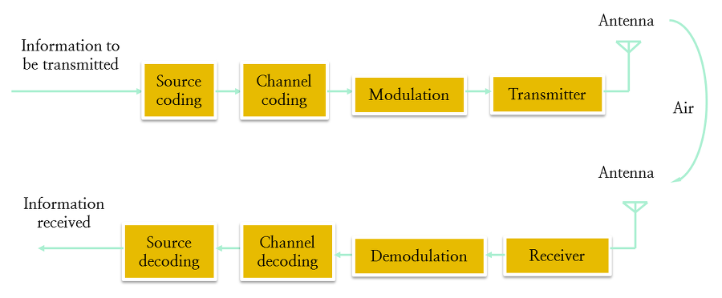

# 04-01. Channel Coding and Error Control

---

## 4.1 소개

- 셀룰러 무선 통신 시스템에서 메시지는  BS와 MS 사이의 잡음이 섞인 매체를 통하여 전달되며 반사, 회절, 산란 등의 현상이 신호의 품질을 떨어뜨림
  - 따라서 무선 신호의 정확한 수신율을 개선할 수 있다면 어떠한 기술이라도 중요 함
- 채널 부호화는 기지국 측에서 원래의 메시지에 이 메시지와 미리 정해진 논리적 연관성을 가진 부가 정보를 추가
- 전송이 되면 수신기는 채널 중에서 열화(코딩)된 부호화 신호를 수신
- 수신기는 본래의 정보와 부가 정보 간의 논리적인 상호관계를 활용하여 열화(코딩)된 신호를 복원하여 원래의 메시지를 찾아낼 가능성을 높임
  - 부가 정보를 추가하는 것은 전송 과정에서 보다 많은 주파수 대역을 사용하게 됨을 의미
  - 그러나 이를 통하여 비트 오류율(BER)을 크게 줄이는 효과를 얻을 수 있음
- **채널 부호화는 신호의 전송 전력과 부가 정보의 양으로 가능할 수 있는 신호의 대역폭을 활용하여 비트오류의 발생을 줄이는 효과를 만듬**
  - 그러나, 셀룰러 시스템에서는 대부분의 트래픽이 압축된 데이터이며, 이는 전송 오류에 매우 민감함
    - 압축된 데이터: 디지털 형식으로 표현된 음향 및 영상 데이터
- 따라서 채널 부호화는 이산 디지털 정보를 신뢰성과 보안성에 초점을 두어 전송에 보다 적합하도록 만드는 과정
  - 채널 부호화는 비트오류율(BER) 또는 프레임 오류율(FER)로 표현되는 전송 품질의 적합성을 보장하는 기술
- 코딩(부호화)의 종류
  - 선형 블록 코딩
    - 해밍 코딩
    - BCH 코딩
    - 리드 솔로몬 코딩
  - Convolution 코딩
  - 터보 코딩

---

