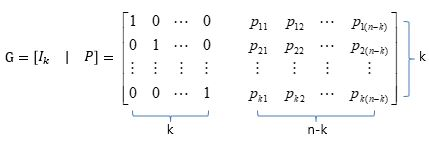
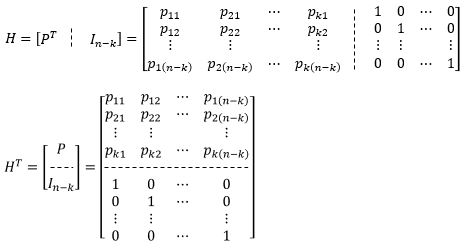

# 04-02 Channel Coding and Error Control

---

## 4.2 선형 블록 코딩 (Linear Block Code)

---

### 개념

- 선형 블록 코딩에서는 전송된 정보열은 항상 미리 선정된 길이 k의 배수로 설정 됨
  - 그렇지 않으면 필요한 만큼의 0을 padding으로 넣어서 길이가 k의 배수가 되도록 만듬
- 각각의 k비트는 (n, k) 선형 블록 코딩에서 n비트의 코드로 코딩됨
  - 예를들어 (8, 6) 코드의 경우 코드 블록의 길이 n = 8이고, 메시지의 길이 k = 6, Parity 길이 n - k = 2가 됨
  - 참고) **Parity**: 전송받은 메시지의 오류를 검출하거나 검증할 때 사용되는 bit
- Linear Block Code의 큰 특징은 code와 code의 **XOR**연산의 결과로 또 다른 code를 생성하는 특징을 가짐
- (n, k)부호에는 2^n개의 서로 다른 조합의 code가 존재
  - 하지만 Linear Block Code는 k개의 **정보 bit로부터 출발하기 때문에 2^k개의 조합만이 code로서 허용** 됨
- 즉, 2^n개의 가능한 비트 유형 가운데 2^k개를 선택하여 이를 coder의 집합으로 정의

### Theorem

#### 기본 정의

- 부호화를 위한 k개의 데이터 비트를 아래와 같이 벡터 m으로 정의
  $$
  \mathbf{m}=(m_1, m_2, ... , m_3)
  $$

- 이 정보에 상응하는 부호어를 아래와 같은 n비트 길이의 벡터 c로 정의
  $$
  \mathbf{c}=(c_1, c_2, ... , c_k, c_{k+1}, ... , c_{n-1}, c_n)
  $$

- 각각의 parity bit는 ⨁(XOR) 심벌로 표현되는 모듈로-2의 가중치 합으로 구성

  - 다음과 같이 예를 들어 보면
    $$
    \begin{cases}
    c_1 = m_1\\
    c_2 = m_2\\
    \cdots\\
    c_k = m_k\\
    c_{k+1} = m_1p_{1(k+1)}\oplus m_2p_{2(k+1)}\oplus\dots\oplus m_kp_{k(k+1)}\\
    \cdots\\
    c_n = m_1p_{1n}\oplus m_2p_{2n}\oplus \dots \oplus m_kp_{kn}
    \end{cases}
    $$

  - 이 식에서
    $$
    p_{ij}=(i=1,2,\dots,k,\quad j=k+1, k+2, \dots, n)
    $$
    은 특정 데이터 비트에 대한 이진 가중치를 의미

- Coding의 원리는 전송측에서 parity를 만들어서 첨가하고 수신측에서는 이 parity를 이용하여 전송 중에 발생할지도 모를 오류에 대응 한다는 것

#### 연산 과정

- 행렬의 표현 형식을 고려해 보면 coder **c**는 원본 데이터 벡터 **m**에 대한 아래의 연산으로 표현
  $$
  \mathbf{c}=\mathbf{mG}
  $$

- 이 식에서 **G**는 생성 행렬로 정의 됨

  - 생성 행렬 **G**는 k X n의 행렬이어야 하며, **I_k**의 항등 행렬(k X k 행렬)과 k X (n - k)의 parity 행렬 **P**를 연결한 구조로 생성 즉,
    $$
    \mathbf{G}=[\mathbf{I}_k|\mathbf{P}]_{k \times n}
    $$
    또는
    $$
    \mathbf{G}=
    \begin{bmatrix}
    1&0&0&\cdots&0&p_{11}&p_{12}&\cdots&p_{1(n-k)}\\
    0&1&0&\cdots&0&p_{21}&p_{22}&\cdots&p_{2(n-k)}\\
    \cdots&\cdots&\cdots&\cdots&\cdots&\cdots&\cdots&\cdots&\cdots&\\
    0&0&0&\cdots&1&p_{k1}&p_{k2}&\cdots&p_{k(n-k)}
    \end{bmatrix}
    $$
    

  - 생성 행렬은 다음과 같이 표현

- Parity 행렬 **P**는 다음과 같이 주어짐
  $$
  \mathbf{P}=
  \begin{bmatrix}
  p_{11}&p_{12}&\cdots&p_{1(n-k)}\\
  p_{21}&p_{22}&\cdots&p_{2(n-k)}\\
  \cdots&\cdots&\cdots&\cdots\\
  p_{k1}&p_{k2}&\cdots&p_{k(n-k)}
  \end{bmatrix}=
  \begin{bmatrix}
  \mathbf{P}^1\\
  \mathbf{P}^2\\
  \cdots\\
  \mathbf{P}^k
  \end{bmatrix}
  $$

- 이 식에서
  $$
  \mathbf{P}^i\mbox{는 }\quad i=1, 2, \dots, k\mbox{ 일때, } \left[\frac{x^{n-k+i-1}}{g(x)}\right]\mbox{의 나머지}
  $$
  g(x)는 생성 다항식으로서
  $$
  \mathbf{P}^i=\mbox{rem}\left[\frac{x^{n-k+i-1}}{g(x)}\right]
  $$
  으로 정의 됨

#### 예시

>어떤 (7, 4) code의 생성 다항식이
>$$
>g(x)=1+x+x^3
>$$
>일 때 Linear Block Code를 구하는 과정이다.

- 이 경우 code(7) = data(4) + parity(3) 임을 알 수 있으므로 아래 관계들을 유도할 수 있음
  $$
  \mathbf{P}^1 = \mbox{rem}\left[\frac{x^3}{1+x+x^3}\right] = 1+x \rightarrow [110]
  $$

  $$
  \mathbf{P}^2 = \mbox{rem}\left[\frac{x^4}{1+x+x^3}\right] = x+x^2 \rightarrow [011]
  $$

  $$
  \mathbf{P}^3 = \mbox{rem}\left[\frac{x^5}{1+x+x^3}\right] = 1+x+x^2 \rightarrow [111]
  $$

  그리고
  $$
  \mathbf{P}^4 = \mbox{rem}\left[\frac{x^6}{1+x+x^3}\right] = 1+x^2 \rightarrow [101]
  $$

- 따라서 생성 행렬은 다음과 같이 구해 짐
  $$
  \mathbf{G}=
  \begin{bmatrix}
  1&0&0&0&1&1&0\\
  0&1&0&0&0&1&1\\
  0&0&1&0&1&1&1\\
  0&0&0&1&1&0&1\\
  \end{bmatrix}
  $$

- 편의를 위하여 code 벡터를 아래와 같이 표현
  $$
  \mathbf{c}=[\mathbf{m}|\mathbf{c}_p]
  $$
  이 식에서
  $$
  \mathbf{c}_p=\mathbf{mP}
  $$
  는 (n - k) bit의 parity check 벡터임

- 행렬 **H**T를 생성 행렬 **G**를 이용하여 다음과 같이 정의

  

- 오류 벡터를 **e**라고 할 때 수신 code 벡터 **x**가 아래와 같이 주어졌다 가정한다.
  $$
  \mathbf{x}=\mathbf{c}\oplus\mathbf{e}
  $$

- 이 경우 행렬 **H**T는 다음과 같은 성질을 가짐
  $$
  \mathbf{cH}^T = [\mathbf{m}|\mathbf{c}_p]\begin{bmatrix}\mathbf{P}\\ \mathbf{I}_{n-k}\end{bmatrix}\\
  = \mathbf{mP}\oplus\mathbf{c}_p\\
  = \mathbf{c}_p\oplus\mathbf{c}_p\\
  = \mathbf{0}
  $$

- **H**T 행렬의 전치 행렬은 다음과 같음
  $$
  \mathbf{H}=[\mathbf{P}^T\mathbf{I}_{n-k}]
  $$

- 이 식에서 **I**n-k는 (n - k) X (n - k)의 항등 행렬이고 **P**T는 parity 행렬 **P**의 전치 행렬이다.

  - 이 **H**를 parity check 행렬 이라 부른다.

- 수신측에서는 아래와 같은 연산으로 Syndrome 으로 명명된 벡터를 구하게 됨
  $$
  \mathbf{s} = \mathbf{xH}^T\\
  =(\mathbf{c}\oplus \mathbf{e})\mathbf{H}^T\\
  = \mathbf{cH}^T\oplus \mathbf{eH}^T\\
  = \mathbf{eH}^T
  $$
  

