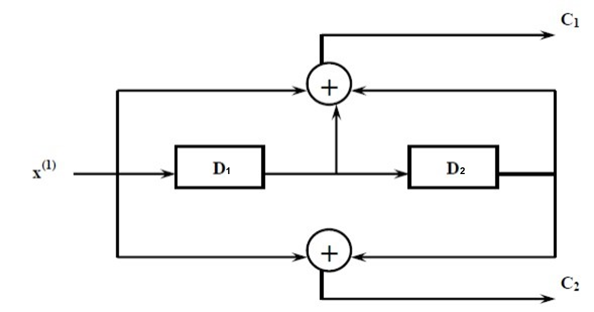
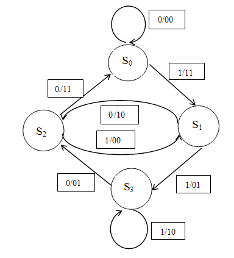

# 04-05. Channel Coding and Error Control

---

## 4.5 Convolutional Code

---

### 개념

- 실제적인 통신 환경에서 가장 많이 사용되는 채널 코딩
  - GSM 혹은 IS-95등
- 주로 실시간 오류 수정에 사용
- Coding된 bit들은 현재의 k개의 입력 데이터 bit에게만 영향을 받을 뿐만 아닌 과거 입력 bit에게도 영향을 받음

#### Theorem

- Convolutional code의 주된 decoding 방식으로는 **Viterbi**알고리즘에 근거됨

- 구속장(Constraint Length) **K**는 아래와 같이 정의 됨
  $$
  K = M + 1
  $$

  - **M**은 생성 shift register에서 연산 단계의 최대 수를 표현

- Shift register는 convolutional code의 상태 정보를 담고 있으며, constraint length에 따라 출력값이 영향을 받는 전/후의 비트 수가 정해짐

- Convolutional code의 code ratio인 ***r***은 다음과 같이 정의 됨
  $$
  r = \frac{k}{n}
  $$

  - ***k***: 병렬 입력 정보의 bit 수
  - ***n***: 하나의 시간 구간 동안에 병렬  출력 code bit 수
  
- ***n***=2, ***k***=1, 즉 ***r***이 1/2인 convolutional code의 coder를 다음과 같이 볼 수 있음

  

  - 출력 bit는 입력 bit와 shift register에 들어 있는 두 개의 과거 bit(D로 표현된)로부터 정해짐

- Convolutional code는 tree diagram이나 trellis diagram등 여러가지의 서로 다른, 그러나 상응한 방법으로 표현이 가능

- 아래 그래프는 위의 coder의 state shift를 나타낸 것

  

- 

