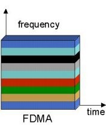
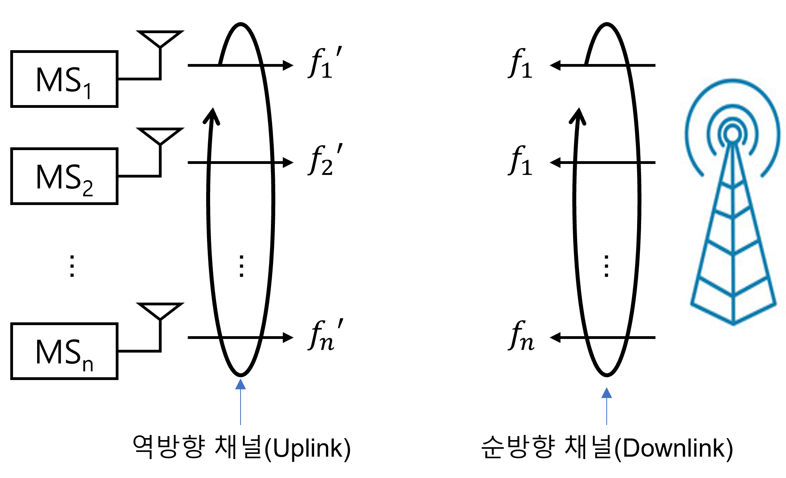
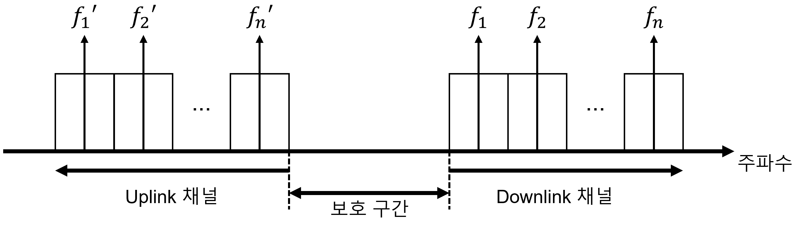
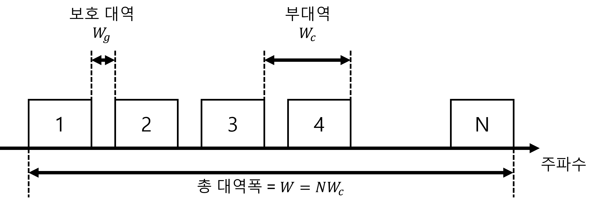

# 07-02. Multiple Division Techniques

---

## 7.2 Multiple Division의 개념과 모형

---

### 7.2.1 FDMA

#### FDMA의 개념

- FDMA는 아래와 같이 신호의 직교성을 제공
  $$
  \int_F s_i(f,t)s_j(f,t)df = \begin{cases}1,&i=j\\0,&i\ne j\end{cases},\quad i,j = 1,2,3,\dots,k
  $$
  
- 위 식은 si(f, t)와 sj(f, t)사이에 주파수 영역 F 상에서 서로 겹치는 영역이 없음

- 따라서, 상호간에 간섭을 주지 않음

  

- FDMA는 무선 전화기 혹은 차량용 전화를 위한 아날로그 시스템에서 사용

- 통신중인 가입자(MS)들에게 서로 다른 carrier frequency를 동적으로 할장

#### FDMA의 작동 방식

- BS와 MS사이의 통신은 한 쌍으로 주파수가 존재

  - 순방향(Downlink): from BS to MS
  - 역방향(Uplink): from MS to BS

- **각각의 가입자(MS)에게 각각 다른 주파수 대역을 할당해 주는 방식**

  - MS1의 Downlink, Uplink 채널 주파수가 f1및 f'1가 될 때, MS2의 채널 주파수는 f2및 f'2가 됨
  - 다음 그림은 FDMA의 통신 방식을 그림으로 표현 한 것

  

- FDMA에서 Downlink와 Uplink 채널에는 보호 구간(**Guard Interval**)이 설정되어 있음

  - Up/Downlink 사이의 간섭(**interference**)를 최소화 하기 위한 보호 대역 **Wg**
  - 각 사용자에게 할당된 주파수 대역은 **Wc**로 표기하며, FDMA 시스템에 N개의 채널이 있다면 총 주파수 대역은 **N·Wc**가 됨

