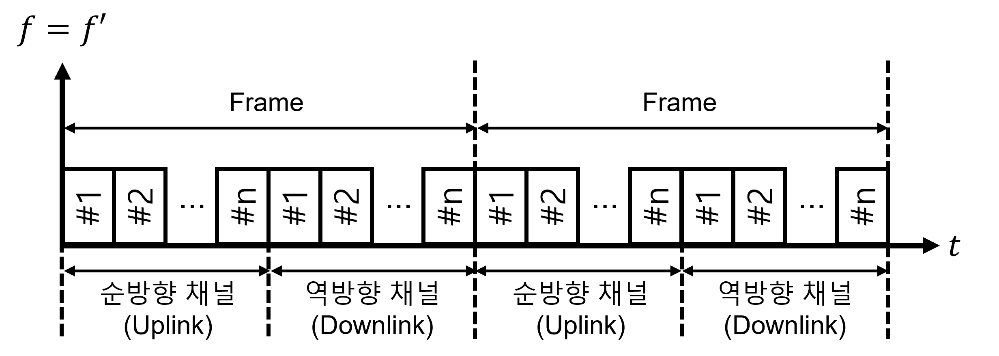

# 07-03. Multiple Division Techniques

---

## 7.2 Multiple Division의 개념과 모형

---

### 7.2.2 TDMA

#### TDMA의 개념

- TDMA에서의 신호 간의 직교 조건은 아래와 같음
  $$
  \int_T s_i(f,t)s_j(f,t)dt = \begin{cases}1, &i=j\\0,&i\ne j\end{cases}, \quad i,j = 1,2,3,\dots,k
  $$
  

- si(f, t) 및 sj(f, t) 사이에는 시간축 T에서 서로 겹치는 시간이 없다는 것을 표현한 것

- 하나의 반송파 주파수를 여러 개의 시간 슬롯으로 나누고, 각 슬롯을 여러 가입자(MS)들에게 나누어 줌

- 통신 채널은 실제로 여러 사용자(MS)들이 서로 다른 슬롯을 사용하면서 효율적으로 공유하기 위하여 여러 개의 시간 슬롯의 묶음으로 정의한 시간 주기(frame)에 따라서 운영

  

  

- TDMA는 고속 디지털 전송을 가능하게 하지만, multipath의 존재에 따른 주파수 selective fading문제가 발생

  - Selective fading이 되지 않을 정도의 크기로 대역폭을 제한
  - 적응형 등화 기법을 사용

- MS내에서는 단속적인 버스트 신호 전송을 가능하게 하기 위하여 고성능의 동기화 회로도 필요

#### FDD

- FDD, Frequency Division Duplex

- 주파수를 나누어 Up/Downlink를 동시에 사용할 수 있도록 수행

  - 단, 주파수를 나누어 사용하기 때문에 한 번에 전송 가능한 량이 줄어듦

  

#### TDD 

- TDD, Time Division Duplex

- 시간을 나누어서 Up/Downlink가 각각 한 번씩 번갈아가며 사용할 수 있도록 수행

  - 기본적으로 주어진 주파수 대역을 온전히 사용할 수 있지만 시간을 나누어 사용하기 때문에 연속적인 전송은 불가능

  

#### TDMA 프레임 구조

