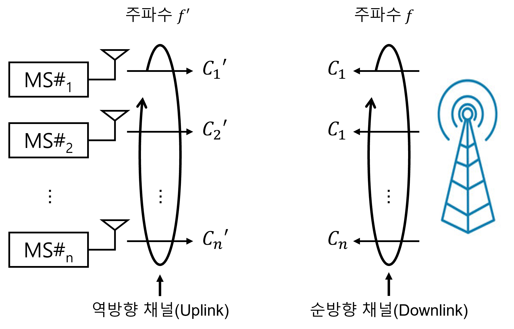

# 07-04. Multiple Division Techniques

---

## 7.2 Multiple Division의 개념과 모형

---

### 7.2.3 CDMA

#### 개념

- CDMA에서의 신호 직교성 조건은 아래와 같이 정의 됨
  $$
  \int_C s_i(t)s_j(t)dt = \begin{cases}1,&i=j\\0,&i\ne j\end{cases}, \quad i,j = 1,2,3,\dots,k
  $$

- 신호 si(t)와 신호sj(t) 사이에는 코드 축 C 상에서 겹쳐지는 부분이 없으며, 신호들은 code 공간에서 공통된 code를 사용하지 않음을 알 수 있음

- CDMA의 시스템은 아래 그림으로 알 수 있음

  

  

- 