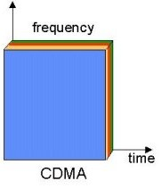
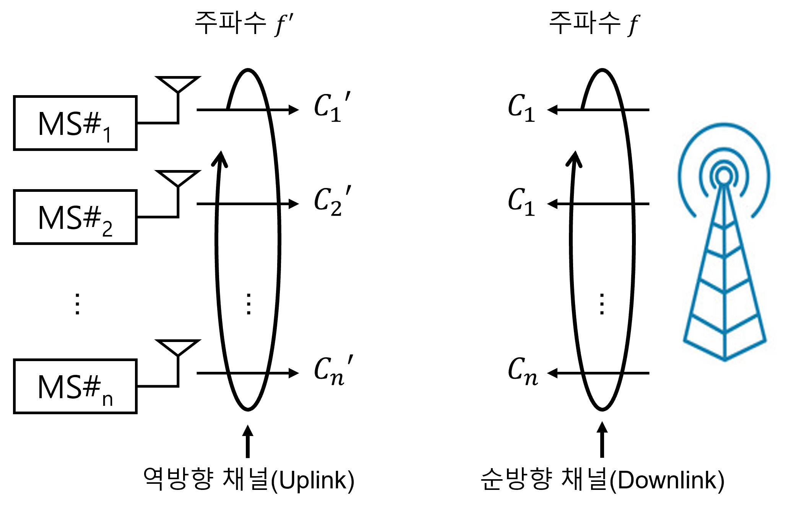

# 07-04. Multiple Division Techniques

---

## 7.2 Multiple Division의 개념과 모형

---

### 7.2.3 CDMA

#### 개념

- CDMA에서의 신호 직교성 조건은 아래와 같이 정의 됨
  $$
  \int_C s_i(t)s_j(t)dt = \begin{cases}1,&i=j\\0,&i\ne j\end{cases}, \quad i,j = 1,2,3,\dots,k
  $$

- 신호 si(t)와 신호sj(t) 사이에는 코드 축 C 상에서 겹쳐지는 부분이 없으며, 신호들은 code 공간에서 공통된 code를 사용하지 않음을 알 수 있음

- CDMA의 시스템은 아래 그림으로 알 수 있음

  

  

- CDMA의 광대역 특징에 의한 RAKE 기법

  - Multipath 성분들의 결합이 가능하기 때문에 fading에 보다 잘 견딤

- 하나의 대역만 사용하는 것이 주파수 활용 효율의 문제

  -  CDMA 시스템에 도입된 전력 제어를 통하여 송출 전력이 조정되고 이것으로 해결되어 주파수 효율을 높임

- 일반적인 CDMA는 멀리 떨어진 MS로부터 오는 신호는 가까이 있는 MS의 신호에 묻혀버릴 수 있음

- CDMA 시스템은 1초 동안 변화되는 bit의 수로 정의되는 속도로 정량화를 수행