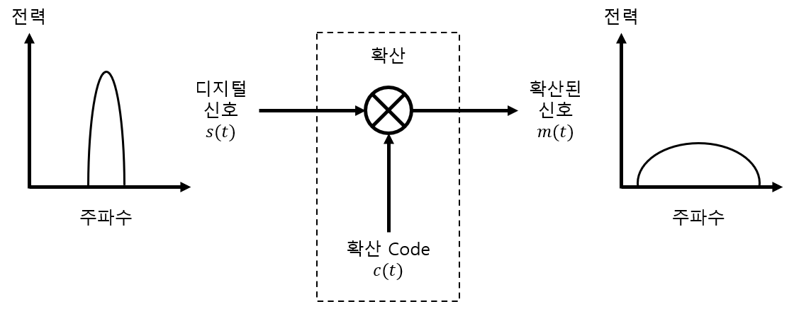

# 07-04. Multiple Division Techniques

---

## 7.2 Multiple Division의 개념과 모형

---

### 7.2.3 CDMA

#### 대역 확산 (Spread Spectrum)

- 신호의 스펙트럼이 데이터 전송에 필요한 최소한의 대역폭 이상의 대역을 차지하도록 하여 전송하는 기법
- 대역 확산은 전송 데이터와는 무관한 부호를 이용하여 전송 단계 이전에 수행
- 수신기에서는 동일한 부호가 신호를 복호하는 과정에 사용
- 확산 신호 c(t)를 이용하여 데이터 신호 s(t)의 대역을 확산하여 전송 신호 m(t)를 만드는 과정을 아래 그림과 같이 설명

$$
m(t)=s(t)\otimes c(t)
$$

- Interference 신호가 많은 영역에 적용할 때 좋은 성능을 얻을 수 있음

#### 직접 수열 대역 확산

- DSSS, Direct Sequence Spread Spectrum
- 